# ETA Model — MLOps Lifecycle

> End-to-end flow from raw data to production inference and back.
> **Auto** = no human approval required. **Manual** = requires explicit sign-off.

```mermaid
flowchart TD
    %% ── DATA LAYER ──────────────────────────────────────────────────
    RAW["📦 Raw Event Stream\n(S3: delivery_events/YYYY-MM-DD/)"]
    FEAT["🗂 Feature Store Snapshot\nartifact: dataset_hash (SHA-256)\nformat: Parquet + schema.json"]
    SPLIT["✂️ Train / Eval Split\nartifact: split_manifest.json\n(frozen eval set, never shuffled)"]

    RAW -->|"Auto — Airflow DAG runs nightly\n→ dataset_hash logged to registry"| FEAT
    FEAT -->|"Auto — deterministic 80/20 split\nseeded by dataset_hash"| SPLIT

    %% ── EXPERIMENTATION ─────────────────────────────────────────────
    EXP["🔬 Experiment Tracking\n(MLflow)\nartifact: run_id, git_sha,\nhyperparams.json, conda env hash"]

    SPLIT -->|"Auto — training job submits run\nwith dataset_hash + git_sha"| EXP

    %% ── TRAINING ────────────────────────────────────────────────────
    TRAIN["⚙️ Training Run\n(Docker image: sha256:…)\nartifact: raw model weights\n+ requirements.lock"]

    EXP -->|"Auto — triggered on\nfeature refresh (bi-weekly)"| TRAIN

    %% ── EVALUATION ──────────────────────────────────────────────────
    EVAL["📊 Evaluation Suite\nfrozen holdout set\nartifact: eval_report.json\n(RMSE, MAE, per-city slices)"]

    TRAIN -->|"Auto — eval job reads\nsplit_manifest.json"| EVAL

    %% ── REGISTRY STAGES ─────────────────────────────────────────────
    STG["🟡 Registry: STAGING\nartifact: model_uri\n(mlflow://northstar-models/eta/v{N})\nstored: ONNX + metadata.yaml"]
    PROD["🟢 Registry: PRODUCTION\nartifact: deployed_version tag\n(eta:production → v{N})"]
    ARCH["⚫ Registry: ARCHIVED\nartifact: archived_uri\nretained for 10 versions"]

    EVAL -->|"Auto — if RMSE ≤ 8.5 min\nAND per-city RMSE ≤ 12 min\nAND no schema drift flag"| STG
    EVAL -->|"Auto — if eval gates FAIL\n→ run stays in Experiments only"| FAIL["❌ Rejected Run\n(logged, not promoted)"]

    STG -->|"Manual — ML Lead + Ops Lead\napprove after canary review"| PROD
    PROD -->|"Auto — when newer version\nreaches PRODUCTION"| ARCH

    %% ── DEPLOYMENT ──────────────────────────────────────────────────
    CANARY["🐦 Canary Deployment\n5 % traffic slice\nartifact: canary_config.yaml\n(version pinned by deployed_version)"]
    FULL["🚀 Full Rollout\n100 % traffic\nartifact: k8s deployment manifest\nimage tag = model_uri digest"]

    PROD -->|"Auto — CD pipeline\npulls model_uri from registry"| CANARY
    CANARY -->|"Manual — approve after\n30-min p95 latency check\n(≤ 150 ms) + error rate < 0.1 %"| FULL

    %% ── MONITORING ──────────────────────────────────────────────────
    MON["📡 Production Monitoring\n(Evidently + Prometheus)\nartifact: drift_report.json\nsignals: PSI > 0.2, RMSE spike > 20 %"]

    FULL -->|"Continuous — inference\nlogs streamed to monitoring"| MON

    %% ── LOOPBACK ────────────────────────────────────────────────────
    MON -->|"Auto — drift_signal triggers\nnew Airflow DAG run\n→ fresh dataset_hash"| RAW
    MON -->|"Auto — SLA breach alert\n→ PagerDuty → rollback\nto previous deployed_version"| PROD

    %% ── STYLING ─────────────────────────────────────────────────────
    classDef data      fill:#1e3a5f,color:#cce4ff,stroke:#4a90d9
    classDef compute   fill:#2d4a22,color:#c8f0b0,stroke:#5cb85c
    classDef registry  fill:#4a3000,color:#ffe5a0,stroke:#f0a500
    classDef deploy    fill:#3b1f4e,color:#e8c8ff,stroke:#9b59b6
    classDef monitor   fill:#4a1a1a,color:#ffc8c8,stroke:#e74c3c
    classDef rejected  fill:#2a2a2a,color:#888,stroke:#555

    class RAW,FEAT,SPLIT data
    class EXP,TRAIN,EVAL compute
    class STG,PROD,ARCH registry
    class CANARY,FULL deploy
    class MON monitor
    class FAIL rejected
```

---

## Artifact Summary Table

| Stage | Artifact | Owner | Durability |
|---|---|---|---|
| Data ingest | `dataset_hash` (SHA-256 of Parquet) | Airflow DAG | S3 versioned |
| Experiment | `run_id`, `git_sha`, `hyperparams.json` | MLflow | MLflow DB |
| Training | `requirements.lock`, Docker `image_sha` | CI | ECR |
| Evaluation | `eval_report.json` (RMSE + slices) | Eval job | MLflow artifact store |
| Staging | `model_uri` (`mlflow://…/eta/v{N}`) | Registry | MLflow Model Registry |
| Production | `deployed_version` tag | Registry | Registry + k8s ConfigMap |
| Deployment | `canary_config.yaml`, k8s manifest | CD pipeline | Git |
| Monitoring | `drift_report.json`, `PSI`, `RMSE_delta` | Evidently | S3 + Prometheus |

## Transition Rules

| Transition | Trigger | Approver |
|---|---|---|
| Raw → Feature Store | Nightly Airflow DAG (02:00 UTC) | — (automatic) |
| Training → Staging | All eval gates pass | — (automatic) |
| Staging → Production | Canary looks healthy | ML Lead + Ops Lead |
| Production → Archived | New version reaches Production | — (automatic) |
| Monitoring → Re-train | PSI > 0.2 on any top-5 feature OR RMSE spike > 20 % over 24 h | — (automatic) |
| Monitoring → Rollback | p95 latency > 150 ms sustained 5 min OR error rate > 0.5 % | PagerDuty alert → Ops on-call |
